클짱이 힘써줬습니다.

# 인페인트 그림체 실험

레퍼런스 인셋(참고 그림을 캔버스 한쪽에 붙이고 빈 칸을 인페인트하는 방식)에서 그림체가 언제 흔들리고
무엇이 결과를 정하는지 확인한 기록입니다. 2026-10-08에 NovelAI V4.5와 V5 인페인트 모델로, 그림체 세
가지(V4.5용 2개, V5용 1개)를 같은 조건표에 넣어 비교했습니다.

## 요약

### 먼저 이렇게 두세요

참고 그림이 세로 832×1216일 때 세 장 모두 한 명이 원본 그림체로 나온 배치입니다.

| 모델 | 배치                                      | 비고                                                            |
| ---- | ----------------------------------------- | --------------------------------------------------------------- |
| V4.5 | 1216×832 · 왼쪽 · 참고 영역 47%           | 캐릭터가 가장 큼. 흰 배경 그림은 의상 태그를 직접 적어야 안정적 |
| V4.5 | 832×1216 · 위 · 전체 보이기 · 50%         | 두 그림체 모두 성공. V5에서는 실패                              |
| V5   | 1216×832 · 왼쪽 · 47%, 작가 태그 3개 이하 | 작가 태그가 16개면 3장 중 1장이 얼굴 시트                       |
| V5   | 1024×1024 · 왼쪽 · 전체 보이기 · 35%      | 캐릭터가 1024px 높이로 가장 큼                                  |

### 무엇이 결과를 정하나

- **그림체는 참고 그림이 정합니다.** 프롬프트로 다른 그림체를 만들려고 해도 결과는 참고 그림을
  따라갑니다. 작가 태그 가중치를 3까지 올리면 색이 조금 움직이지만, 그보다 먼저 구도가 깨집니다.
- **모델은 참고 그림과 같은 크기로 그리고, 남는 공간을 다른 것으로 채웁니다.** 그래서 생성 칸에 참고
  그림 크기의 그림이 딱 하나 들어가게 두는 것이 핵심입니다. 남는 공간을 V4.5는 복제와 얼굴 컷으로,
  V5는 썸네일 격자, 웹페이지·채팅 화면, 글자로 채웁니다. 폭이 좁고 세로로 긴 칸(가로:세로 1:2 이상)은
  두 모델 모두 얼굴 아이콘 시트가 됩니다.
- **참고 그림이 작게 그려지면 V4.5는 그림체가 흔들립니다.** 작가 태그가 많을수록 심해서, 20개가 넘으면
  47%에서만 원본 그림체가 나왔고 3개 이하이면 25%에서도 유지됐습니다. V5는 그림체가 거의 흔들리지 않고
  구도만 무너졌습니다. 다만 V5에서도 작가 태그가 많을수록 구도가 더 자주 무너졌습니다.
- **흰 배경 참고 그림은 칸 테두리가 보이지 않습니다.** 생성 칸 모양에 맞춰 그려서, 세로로 긴 칸에는 한
  명, 가로로 넓은 칸에는 두 명을 그립니다. 상반신만 위에 두면 그 아래 몸을 이어 그립니다.
- **V4.5에서 찾은 배치가 V5에서도 통하지는 않습니다.** V4.5에서 가장 안정적이던 세로 캔버스 위 배치는
  V5에서 세 장 모두 실패했습니다.

### 해 봤지만 해결책이 아니었던 것

- **꽉 채우기:** 캐릭터가 크게 들어가 그림체는 지키지만, 좁은 참고 영역에서는 거의 매번 여러 칸으로
  복제됩니다. 45~50%에서는 전체 보이기와 차이가 거의 없습니다.
- **작가 태그 가중치 올리기:** 색만 조금 바뀌고 구도가 먼저 깨집니다.
- **`reference inset` 태그 켜고 끄기:** 일관된 효과가 없었습니다. 앱 기본값(켜기)을 바꿀 근거는 없습니다.
- **`split screen`, `2koma`:** 참고 영역 크기를 대신하지 못합니다. 47%에서는 태그와 관계없이 성공했고,
  35%에서는 그림체에 따라 달랐습니다. `split screen`은 흰 배경 그림의 두 명 그리기를 줄이는 대신 배경
  장면을 그렸고, `2koma`는 V5 35%에서만 확실히 나았습니다.

### 피해야 할 태그

- **포지티브 안의 강한 음수 가중치와 강조된 색 태그**(`1.5::pastel colors::`와 `-3::...::` 등)가 겹치면,
  생성 칸이 좁을 때 빈 종이나 글자 문서가 나옵니다.

## 실험 방법

앱의 프롬프트 합성, 요청 생성, NovelAI 호출 코드를 그대로 쓰는 별도 스크립트로 생성했습니다. 조건마다
하나만 바꾸고 같은 시드 세 개로 생성해 비교했습니다. 같은 조건을 다시 생성하면 같은 그림이 나오는 것도
확인했습니다.

| 항목            | 값                                                                                                                                                                             |
| --------------- | ------------------------------------------------------------------------------------------------------------------------------------------------------------------------------ |
| 모델            | `nai-diffusion-4-5-full-inpainting`. 실험 V는 `nai-diffusion-5-full-inpainting`                                                                                                |
| 캔버스          | 1216×832, 참고 그림 왼쪽, 전체 보이기(contain), 위쪽 정렬, 흰 여백. 실험 C는 꽉 채우기(cover), 실험 S는 정사각·세로 캔버스                                                     |
| 생성            | 28스텝, `k_euler_ancestral`, 인페인트 강도 1, 보호 영역 확장 8px. 실험 V는 프리셋대로 23스텝, karras                                                                           |
| 캐릭터 프롬프트 | `girl, solo, 0.6::dynamic angle::, cowboy shot, medium breasts, platinum blonde hair, purple eyes, purple hair ribbon, star hair ornament`. 실험 V는 아래 3번 그림체 설명 참고 |
| 감정            | 중립 (`neutral expression, closed mouth`)                                                                                                                                      |
| 비용            | Opus 무료 범위. 모든 생성에서 Anlas 변화 없음                                                                                                                                  |

참고 그림은 두 가지입니다. 둘 다 메인 V4.5 모델로 만든 832×1216 그림입니다.

|        | 1번 그림체                               | 2번 그림체                                     |
| ------ | ---------------------------------------- | ---------------------------------------------- |
| 모습   | 짙은 남색 배경, 붓 터치가 살아 있는 채색 | 흰 배경, 파스텔, 얇은 선                       |
| 프리셋 | `테스트` (작가 태그 20개 이상, CFG 7)    | `v4.5` (작가 태그 7개, CFG 7, CFG rescale 0.4) |

"작가 3개"는 작가 태그를 세 개만 남긴 것이고, "작가 없음"은 작가 태그를 모두 뺀 것입니다. 나머지
태그는 그대로 두었습니다. 작가 태그 목록은 문서에 싣지 않았습니다.

## 실험 1: 1번 그림체에서 무엇이 그림체를 흔드나

지금 쓰는 설정(참고 영역 30%)을 기준으로 한 가지씩 바꿨습니다.

| 조건                                | 결과                                          |
| ----------------------------------- | --------------------------------------------- |
| A 기준 (30%, 작가 20개 이상)        | ✗ 세 장 모두 그림체·포즈·배경이 제각각        |
| B 작가 3개                          | ✓ 원본에 가까움                               |
| C `animated`와 음수 가중치만 뺌     | ✗ A와 같이 흔들림. 한 장은 두 칸으로 갈라짐   |
| D 참고 영역 45% (프롬프트는 그대로) | ✓✓ 원본과 거의 같음. 표정만 프롬프트대로 바뀜 |
| E 작가 없음                         | ✓ 원본 그림체. 디테일은 D보다 조금 약함       |

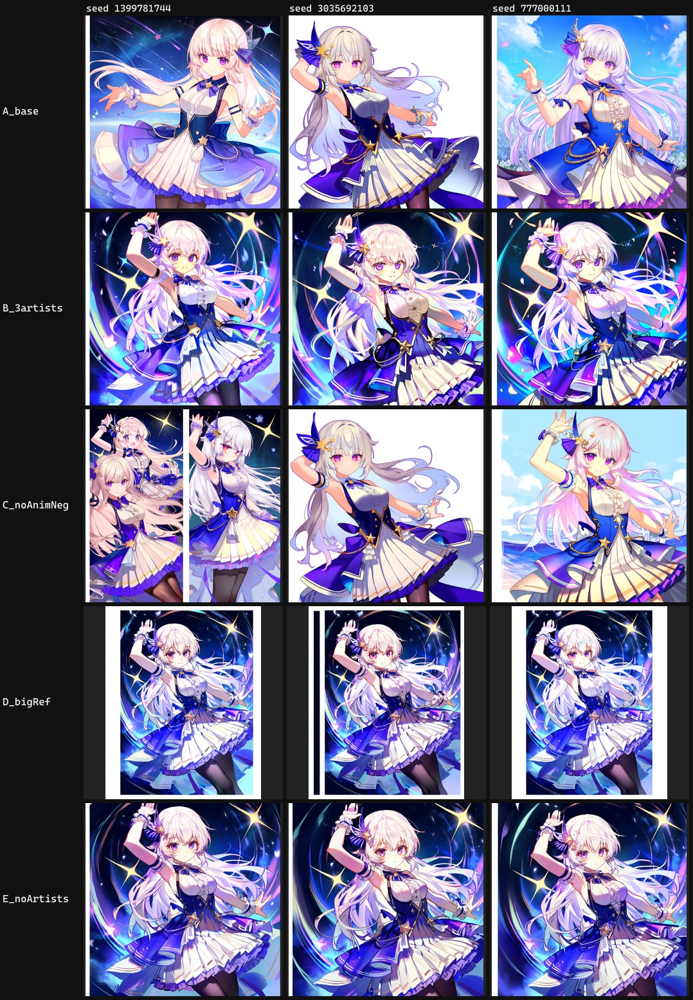

## 실험 1b: 참고 영역 크기 × 작가 태그 수 (1번 그림체)

| 참고 영역 | 작가 20개 이상                         | 작가 3개               | 작가 없음                     |
| --------- | -------------------------------------- | ---------------------- | ----------------------------- |
| 25%       | ✗ 콜라주·여러 칸, 배경과 그림체가 바뀜 | ✓ (눈색만 조금 노랗게) | ✓ (한 장에 작은 얼굴 컷 섞임) |
| 35%       | ✗ 2칸·4칸 복제 2장, 그림체 변화 1장    | ✓                      | ✓                             |
| 47%       | ✓                                      | ✓                      | ✓                             |

작가 태그가 많을 때만 참고 영역 크기가 결과를 가릅니다.

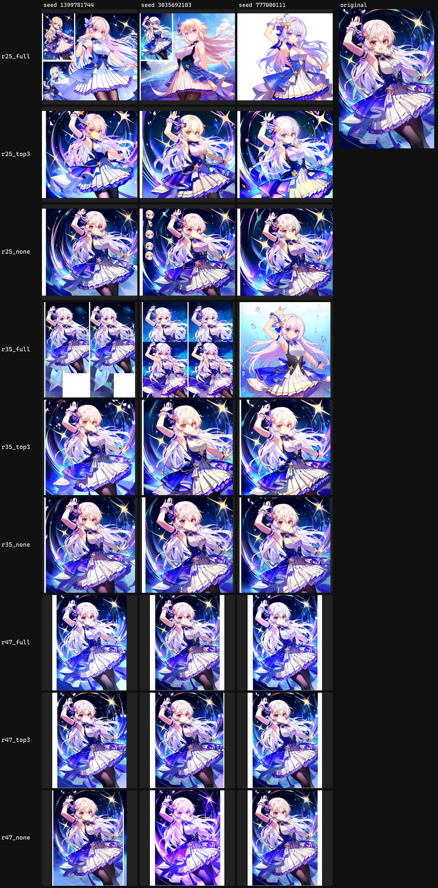

## 실험 2: 같은 조건표를 2번 그림체로

| 참고 영역 | 작가 7개                                    | 작가 3개                   | 작가 없음             |
| --------- | ------------------------------------------- | -------------------------- | --------------------- |
| 25%       | 그림체 유지. 한 장은 캐릭터가 두 명         | 그림체 유지. 한 장은 두 명 | 세 장 모두 두 명      |
| 35%       | 클로즈업, 두 명 섞임                        | 두 장이 두 명              | 두 명, 만화 칸        |
| 47%       | 한 명. 의상이 두 번 바뀜(검은 치마, 비키니) | 빈 종이·글자 문서 2장      | 빈 종이·글자 문서 3장 |

- 작가 태그가 7개라 참고 영역이 작아도 그림체는 대체로 유지됐습니다.
- 생성 칸이 넓을 때 캐릭터를 두 명 그렸습니다. 실험 S로 보면, 흰 배경 그림은 칸 테두리가 보이지 않아
  생성 칸 모양에 맞춰 그립니다. 가로로 넓은 칸(912×832)에는 서 있는 캐릭터 두 명이 들어가서 두 명이
  나왔고, 세로로 긴 칸(672×1024)에서는 한 명이 나왔습니다.
- 캐릭터 프롬프트에 의상 태그가 없어, 참고 신호가 약할 때 의상이 바뀌었습니다.
- 빈 종이의 원인은 실험 B에서 찾았습니다.

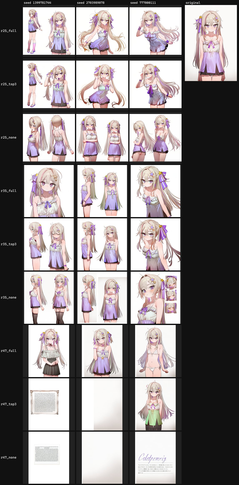

## 실험 X·Y: 참고 그림과 다른 그림체를 프롬프트로 만들 수 있나

- **X:** 1번 그림을 참고로, 2번 프리셋으로 생성
- **Y:** 2번 그림을 참고로, 1번 프리셋으로 생성

조건표와 시드는 실험 1b, 실험 2와 같습니다.

|                        | 결과                                                                                          |
| ---------------------- | --------------------------------------------------------------------------------------------- |
| Y (파스텔 → 짙은 남색) | 27장 모두 참고 그림의 파스텔·흰 배경 그대로. 별빛 배경이나 짙은 채색은 한 장도 없음           |
| X (짙은 남색 → 파스텔) | 대부분 참고 그림의 배경과 포즈를 따라감. 35%에서 몇 장만 색이 밝아짐. 47%는 빈 종이·글자 문서 |

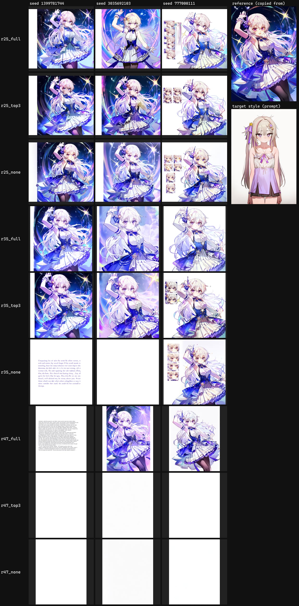

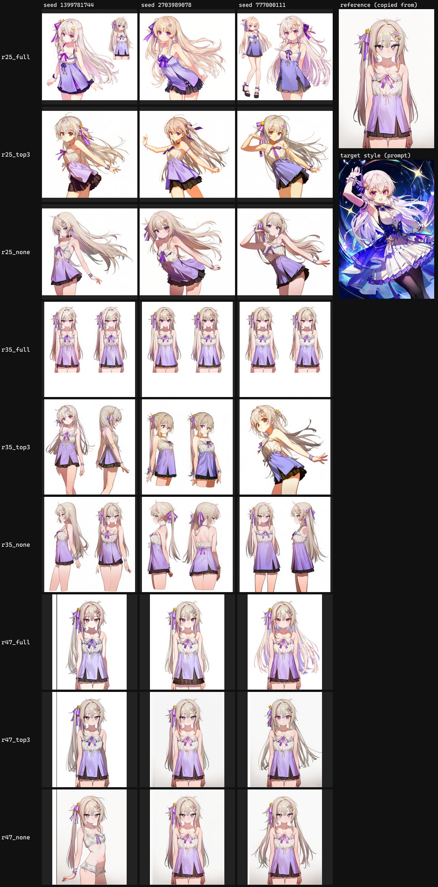

## 실험 W: 작가 3개의 가중치를 올리면 바뀌나

실험 X·Y의 "작가 3개" 조건에서 세 작가의 가중치를 1.5, 2, 3으로 올렸습니다. 참고 영역은 프롬프트
영향이 가장 큰 25%와 35%입니다.

| 가중치 | WX (짙은 남색 → 파스텔)                                                    | WY (파스텔 → 짙은 남색)                  |
| ------ | -------------------------------------------------------------------------- | ---------------------------------------- |
| 1      | 참고 그림 그대로                                                           | 참고 그림 그대로                         |
| 1.5    | 거의 변화 없음. 표정 시트가 더 자주 나옴                                   | 거의 변화 없음                           |
| 2      | 배경이 조금 밝아짐                                                         | 머리색이 누렇게 변하기 시작              |
| 3      | 배경이 하얘지고 색이 옅어짐. 대신 엉뚱한 소품, 액자, 얼굴 컷 콜라주가 섞임 | 머리가 금색, 치마가 주황색으로 색만 변함 |

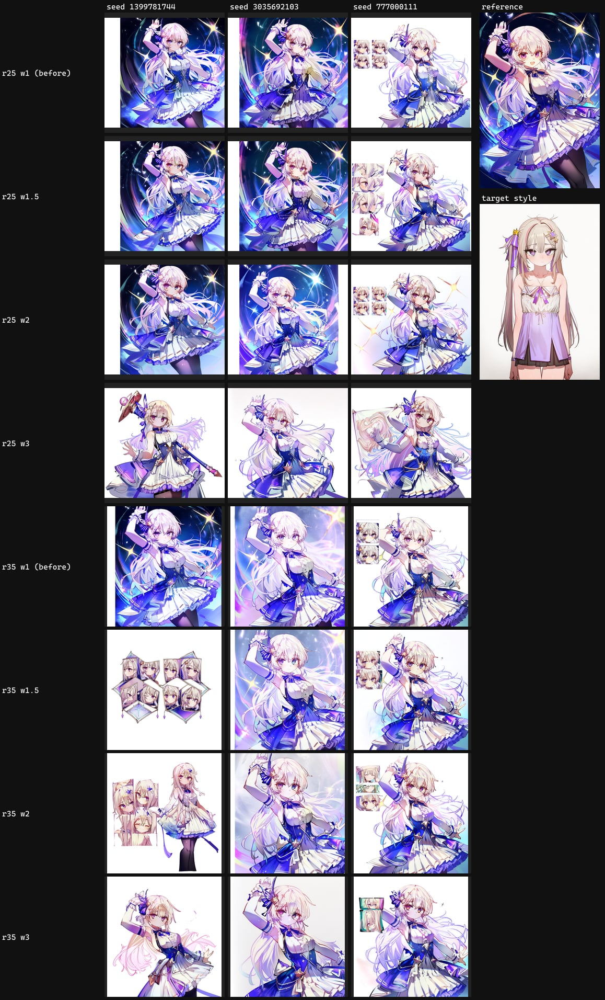

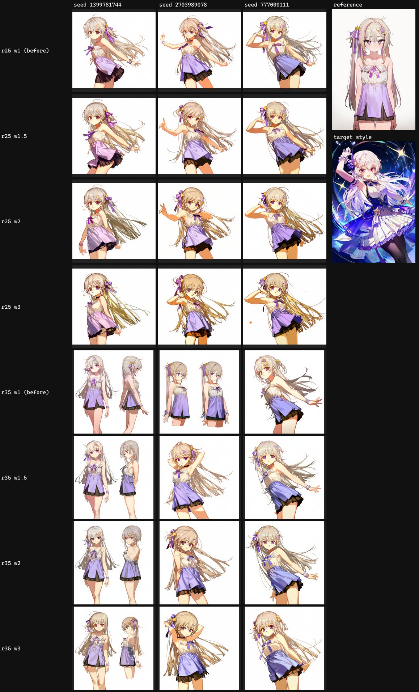

## 실험 B: 빈 종이와 글자 문서의 원인

실험 X에서 세 장 모두 빈 종이였던 조건(참고 영역 47%, 2번 프리셋, 작가 없음)에서 후보를 하나씩 뺐습니다.

| 뺀 것                                                                                                              | 결과 (3장)                                          |
| ------------------------------------------------------------------------------------------------------------------ | --------------------------------------------------- |
| (없음, 대조군)                                                                                                     | ✗ 이전과 똑같은 빈 종이 3장                         |
| `1.5::pastel colors::`                                                                                             | ✓ 세 장 모두 정상. 참고 그림도 가장 충실하게 따라감 |
| 음수 가중치 묶음 (`-1::flat color::`, `-3::multiple views::`, `-3::thick lineart::`, `-3::artist collaboration::`) | ✓ 세 장 모두 정상                                   |
| `novel illustration`                                                                                               | △ 1장 정상, 나머지는 장식 글자와 얼굴 시트          |
| `official art`                                                                                                     | △ 1장 정상, 나머지는 글자 문서와 얼굴 시트          |
| `-1::clean text::`                                                                                                 | ✗ 세 장 모두 글자 문서로 바뀜                       |
| `solo artist`                                                                                                      | ✗ 빈 종이 3장                                       |
| reference inset을 맨 끝에서 맨 앞으로                                                                              | ✗ 글자 문서와 얼굴 시트                             |

- 파스텔을 1.5배로 강조하고 선과 단색 채색을 음수 가중치로 누르니, 좁은 칸에서 모델이 "옅고 선 없는
  그림", 곧 하얀 종이로 결론 낸 것으로 보입니다. 둘 중 하나만 빼도 해결됐습니다.
- 빈 종이와 글자 문서는 같은 현상입니다. `-1::clean text::`가 글자를 누르고 있어서 빈 종이였고, 그
  태그를 빼자 글자가 나타났습니다.
- 작가 태그가 있으면 그림 쪽 신호가 강해 이 현상이 나오지 않았습니다.

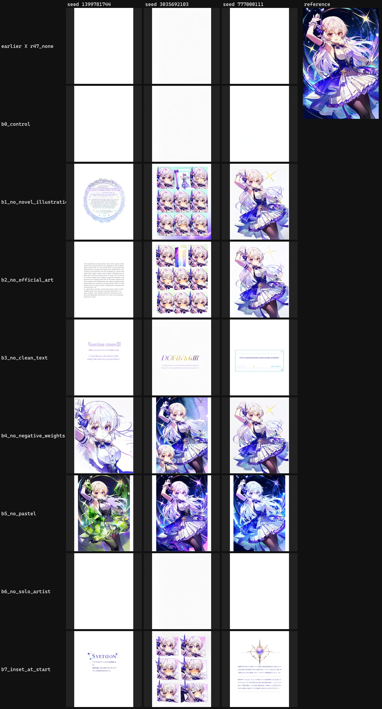

## 실험 C: 꽉 채우기

인페인트 설정의 "꽉 채우기"(cover)는 참고 그림을 칸 높이에 맞춰 키우고 넘치는 양옆을 잘라 냅니다.
세로 그림을 좁은 칸에 넣으면 참고 영역 25%에서 폭 304px, 35%에서 424px의 세로 띠가 됩니다. 실험 1b,
실험 2와 프리셋·조건표·시드를 같게 두고 배치 방식만 바꿨습니다.

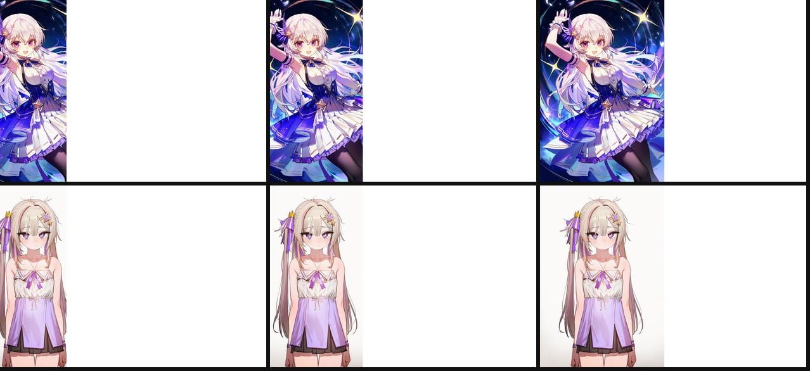

| 참고 영역 | 1번 그림체 (작가 20개 이상)                  | 2번 그림체 (작가 7개)                        |
| --------- | -------------------------------------------- | -------------------------------------------- |
| 25%       | 그림체는 유지. 대신 거의 모두 2~6칸으로 복제 | 거의 모두 2~3명이 나란히                     |
| 35%       | 그림체 유지. 9장 중 6장이 2칸 복제           | 거의 모두 2명                                |
| 47%       | ✓ 한 명, 원본 그림체                         | 전체 보이기와 같은 결과 (의상 변화, 빈 종이) |

- 작가 태그 20개 이상인 1번 그림체도 25%에서 그림체가 흔들리지 않았습니다. 같은 조건을 전체 보이기로
  넣었을 때는 콜라주로 무너졌습니다. 그림체를 정하는 것은 캐릭터가 그려진 크기입니다.
- 대신 모델이 캔버스를 여러 칸짜리 시트로 보고, 참고 칸과 같은 폭의 칸을 생성 영역에 반복해 채웠습니다.
  304px 띠 옆에 912px 생성 칸을 두면 띠가 2~3개 더 그려집니다. 생성 칸(648px)이 참고 칸(568px)과
  비슷한 47%에서만 한 명이 나왔습니다.
- 47%에서는 원래 그림이 칸에 꽉 차서 두 방식의 캔버스가 같고, 결과도 전체 보이기 때와 같은 그림이
  나왔습니다.

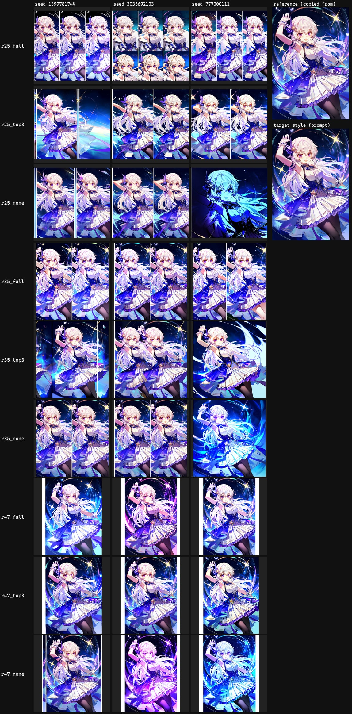

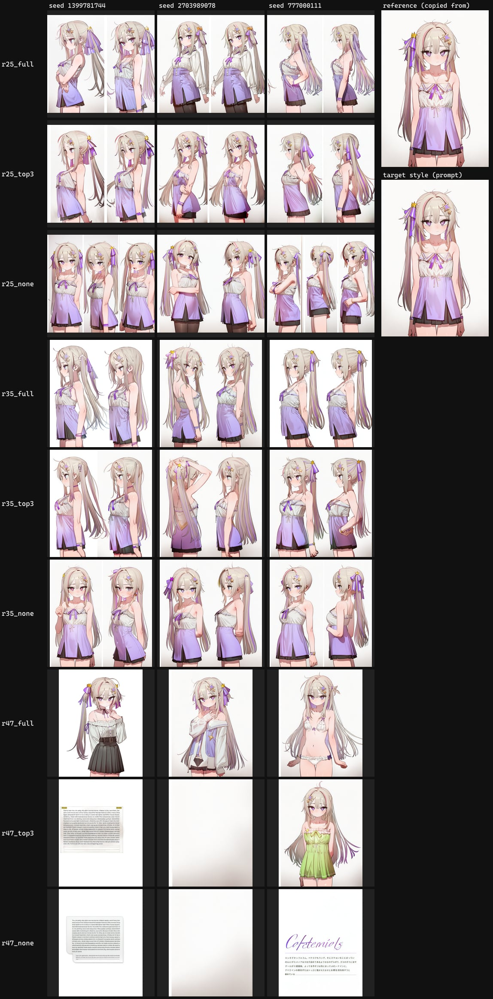

## 실험 S: 정사각·세로 캔버스

캔버스 모양을 바꿔 같은 원리가 통하는지 확인했습니다. 두 프리셋 모두 작가 태그 전체를 썼습니다.

| 캔버스 · 배치                    | 참고 그림 크기     | 생성 칸  | 1번 (짙은 배경, 작가 20개 이상)          | 2번 (흰 배경, 작가 7개)             |
| -------------------------------- | ------------------ | -------- | ---------------------------------------- | ----------------------------------- |
| 1024×1024 · 왼쪽 · 전체 35%      | 352×514            | 672×1024 | ✗ 참고 그림 크기로 2×2 = 4장 복제        | ✓ 한 명                             |
| 1024×1024 · 왼쪽 · 전체 50%      | 512×748            | 512×1024 | △ 같은 크기로 한 장, 남은 아래에 얼굴 컷 | ✓ 한 명                             |
| 1024×1024 · 왼쪽 · 전체 68%      | 696×1017 (꽉 참)   | 328×1024 | ✗ 얼굴 아이콘 시트                       | ✗ 빈 종이                           |
| 1024×1024 · 왼쪽 · 꽉 채우기 50% | 512×1024 띠        | 512×1024 | ✗ 얼굴 아이콘 시트                       | △ 한 명. 의상 바뀜                  |
| 832×1216 · 왼쪽 · 전체 50%       | 416×608            | 416×1216 | ✗ 위아래로 2장 복제                      | ✗ 2장 복제, 작은 한 명              |
| 832×1216 · 왼쪽 · 꽉 채우기 50%  | 416×1216 띠        | 416×1216 | ✗ 얼굴 아이콘 시트                       | ✗ 빈 종이, 글자                     |
| **832×1216 · 위 · 전체 50%**     | 416×608            | 832×608  | **✓ 세 장 모두 한 명, 원본 그림체**      | **✓ 세 장 모두 한 명, 원본 그림체** |
| 832×1216 · 위 · 꽉 채우기 50%    | 832×608 (상반신만) | 832×608  | △ 상반신 2장, 얼굴 시트 1장              | ✗ 얼굴 없이 아랫몸만 그림           |

- 모델은 참고 그림과 같은 크기로 그리고 남는 공간을 다른 것으로 채웠습니다. 352×514 참고 그림 옆
  672×1024 칸에는 같은 크기 4장, 512×748 옆 512×1024 칸에는 같은 크기 1장과 얼굴 컷이 들어갔습니다.
  416×608 참고 그림을 위에 두면 아래 832×608 칸에 같은 크기 그림이 딱 하나 들어가서, 두 그림체 모두
  성공했습니다.
- 폭이 좁고 세로로 긴 칸(가로:세로 1:2 이상)은 1번 그림체에서 모두 얼굴 아이콘 시트가 됐습니다.
- 흰 배경인 2번 그림체는 참고 그림을 칸으로 인식하지 않아, 1번이 복제된 정사각 35%·50%에서도 큰 한 명을
  그렸습니다. 대신 위쪽을 꽉 채우기(상반신)로 넣으면 그 아래 몸을 이어 그려서 얼굴 없는 아랫몸이
  나왔습니다.
- 2번의 빈 종이는 실험 B의 프리셋 태그 문제가 좁은 칸에서 다시 나온 것입니다.
- 위에 두는 배치는 안정적이지만, 캐릭터 높이가 608px로 1216×832·47% 배치(832px)보다 작습니다.

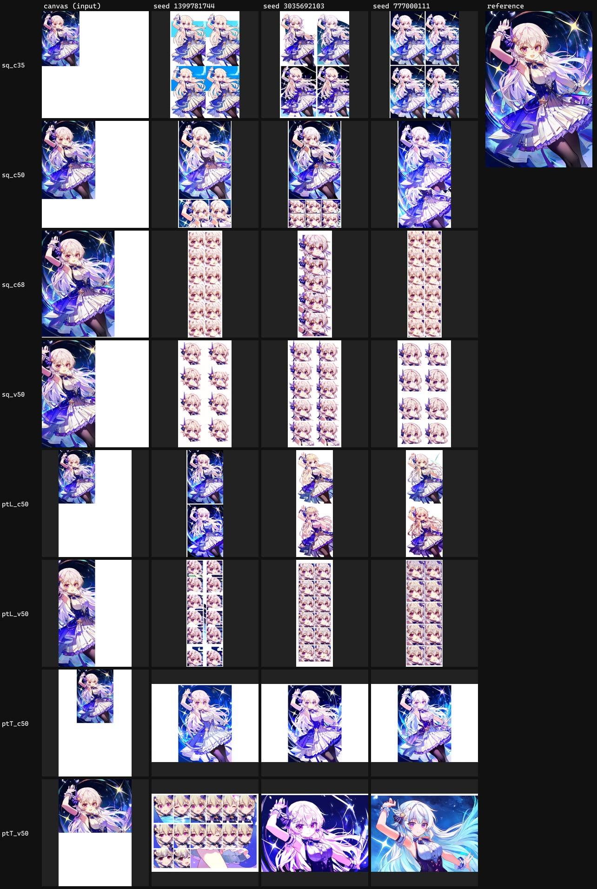

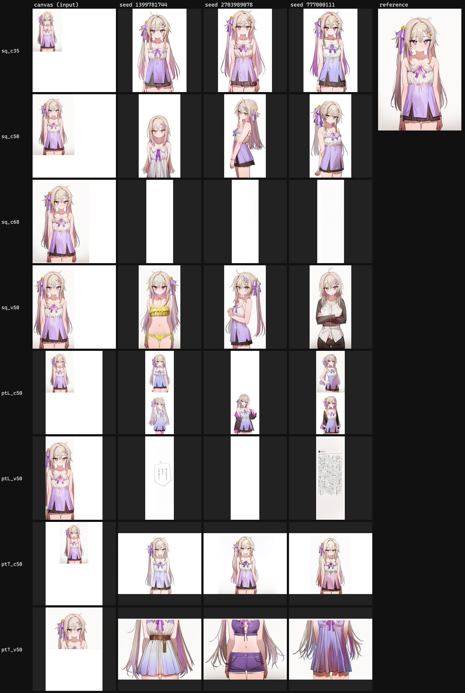

## 실험 V: V5로 다시 (1b와 S)

V5 인페인트 모델로 실험 1b(참고 영역 × 작가 태그 수)와 실험 S(캔버스 모양)의 조건표를 다시
돌렸습니다. 참고 그림과 프리셋은 V5용으로 따로 만든 3번 그림체입니다. 시드 세 개와 중립 감정은 이전과
같고, 모든 생성에서 Anlas 변화는 없었습니다.

|                 | 3번 그림체                                                                                                                                                                                                        |
| --------------- | ----------------------------------------------------------------------------------------------------------------------------------------------------------------------------------------------------------------- |
| 모습            | 흰 배경, 부드러운 채색, 고딕 메이드 (832×1216, 메인 V5 모델로 만듦)                                                                                                                                               |
| 프리셋          | 작가 태그 16개, 23스텝, CFG 6, karras. 네거티브에 `multiple views`, `blank page`, `watermark` 등                                                                                                                  |
| "작가 3개"      | 작가 태그를 세 개만 남김                                                                                                                                                                                          |
| 캐릭터 프롬프트 | `girl, solo, pale skin, silver hair, very long hair, twintails, flowing hair, 1.2::haughty::, tsundere, blue eyes, -1.0::thick::, bare shoulders, gothic lolita maid, black corset, velvet choker, garter straps` |

### V1b: 참고 영역 × 작가 태그 수

| 참고 영역 | 작가 16개                                                     | 작가 3개                                           | 작가 없음                                          |
| --------- | ------------------------------------------------------------- | -------------------------------------------------- | -------------------------------------------------- |
| 25%       | ✗ 같은 크기 6장 복제, 의상이 다른 6명 콜라주. 1장은 큰 뒷모습 | △ 2장은 왼쪽 위에 작은 복제가 붙은 큰 한 명, 1장 ✓ | △ 작은 복제나 액자 그림이 붙은 큰 한 명 2장, 1장 ✓ |
| 35%       | 1장 ✓, 1장 얼굴 시트, 1장 구석에 썸네일                       | 1장 ✓, 1장 두 명과 글자, 1장 액자 그림과 실내 배경 | 작가 3개와 같은 모습                               |
| 47%       | 2장 ✓, 1장 얼굴 시트와 글자                                   | ✓ 세 장 모두                                       | ✓ 세 장 모두                                       |

- 그림체는 흔들리지 않았습니다. 작가 16개·25%에서도 캐릭터가 제대로 그려진 장은 원본 그림체였습니다.
  V4.5의 1번 그림체가 25%·35%에서 그림체까지 바뀐 것과 다릅니다.
- 실패는 구도 쪽에서 나왔습니다. 복제와 얼굴 시트는 V4.5와 같고, V4.5에서 없던 글자(한자·한글처럼
  보이는 문장), 액자 그림, 썸네일이 새로 나왔습니다. 네거티브에 `multiple views`, `blank page`,
  `watermark`가 있는데도 나왔습니다.
- 작가 태그 수는 여전히 영향이 있습니다. 47%에서 작가 16개는 1장이 실패했고, 3개 이하는 6장 모두
  성공했습니다.
- 47%에서는 참고 그림과 거의 같은 포즈와 구도로 그렸습니다.

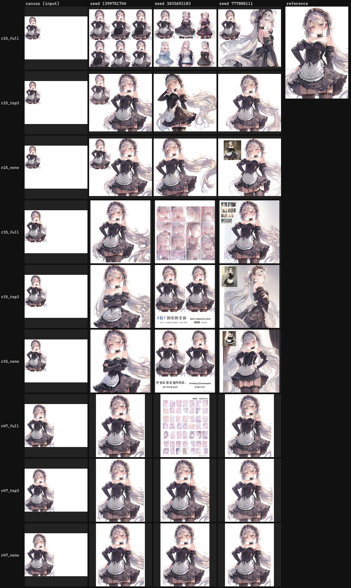

### VS: 캔버스 모양

작가 태그는 16개 전체를 썼습니다. 오른쪽 두 열은 실험 S의 V4.5 결과입니다.

| 캔버스 · 배치                    | 생성 칸  | V5 · 3번 (흰 배경, 작가 16개)                             | V4.5 · 1번 | V4.5 · 2번 |
| -------------------------------- | -------- | --------------------------------------------------------- | ---------- | ---------- |
| 1024×1024 · 왼쪽 · 전체 35%      | 672×1024 | **✓ 세 장 모두 큰 한 명** (1장은 구석에 워터마크 글자)    | ✗          | ✓          |
| 1024×1024 · 왼쪽 · 전체 50%      | 512×1024 | △ 같은 크기 한 명, 아래 남는 칸에 썸네일 격자·저작권 글자 | △          | ✓          |
| 1024×1024 · 왼쪽 · 전체 68%      | 328×1024 | ✗ 얼굴 아이콘 시트 3장                                    | ✗          | ✗          |
| 1024×1024 · 왼쪽 · 꽉 채우기 50% | 512×1024 | △ 1장 전신 한 명, 2장 잡지 지면·썸네일 격자               | ✗          | △          |
| 832×1216 · 왼쪽 · 전체 50%       | 416×1216 | ✗ 세 장 모두 위아래 2장 복제                              | ✗          | ✗          |
| 832×1216 · 왼쪽 · 꽉 채우기 50%  | 416×1216 | ✓ 세 장 모두 한 명 (2장 전신, 1장 상반신)                 | ✗          | ✗          |
| 832×1216 · 위 · 전체 50%         | 832×608  | ✗ 가운데 한 명, 양옆에 썸네일·채팅 화면 같은 UI           | ✓          | ✓          |
| 832×1216 · 위 · 꽉 채우기 50%    | 832×608  | ✗ 상반신 확대와 UI 2장, 아랫몸만 1장                      | △          | ✗          |

- 참고 그림 크기로 그리고 남는 공간을 채우는 원리는 V5에서도 같습니다. 채우는 내용이 V4.5는 복제와
  얼굴 컷, V5는 썸네일 격자, 잡지 지면, 웹페이지·채팅 화면 같은 UI였습니다.
- V4.5에서 두 그림체 모두 성공한 "세로 캔버스 · 위 · 전체 50%"는 V5에서 세 장 모두 실패했습니다.
  832×608 생성 칸에 416px 폭의 한 명을 그리고 양옆을 UI로 채웠습니다. V4.5에서 찾은 배치가 V5에서도
  통한다고 볼 수 없습니다.
- 흰 배경 그림이 생성 칸 모양에 맞춰 그리는 것도 같습니다. 정사각 35%의 672×1024 칸에는 큰 한 명,
  꽉 채우기의 416×1216 띠에는 전신 한 명이 들어갔습니다.
- 폭이 좁고 세로로 긴 칸(328×1024)은 V4.5와 같이 얼굴 아이콘 시트가 됐습니다.

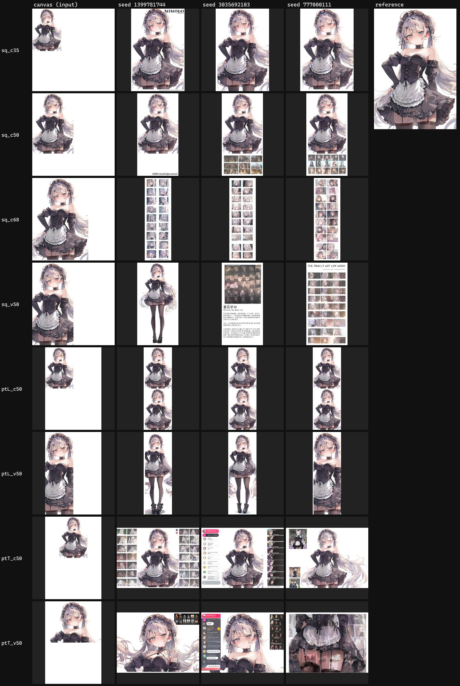

## 실험 I: reference inset 태그, split screen, 2koma

지금까지의 실험은 모두 앱 기본값대로 `reference inset` 태그를 넣은 상태였습니다. 이 태그를 빼거나,
커뮤니티에서 쓰는 `split screen`, `2koma`를 포지티브 맨 앞에 넣어 비교했습니다. 세 그림체 모두 작가
태그 전체, 1216×832 · 왼쪽 · 전체 보이기에서 참고 영역 35%와 47%를 썼습니다.

| 조건           | 프롬프트                                                                    |
| -------------- | --------------------------------------------------------------------------- |
| inset (대조군) | 앱 기본값. `reference inset`을 프리셋 위치(1번·3번 맨 앞, 2번 맨 끝)에 넣음 |
| 끔             | `reference inset` 없음                                                      |
| split          | `reference inset` 없이 `split screen`                                       |
| 2koma          | `reference inset` 없이 `2koma`                                              |
| inset + split  | `reference inset, split screen`                                             |

대조군은 실험 1b, 실험 2, 실험 V1b의 같은 조건과 픽셀까지 같은 그림이 나왔습니다. 프롬프트를 한
단어만 바꿔도 같은 시드에서 다른 그림이 나오므로, 세 장 중 한 장 차이는 우연일 수 있습니다.

### 1번 그림체 (V4.5, 짙은 배경, 작가 20개 이상)

| 조건           | 35%                                 | 47%          |
| -------------- | ----------------------------------- | ------------ |
| inset (대조군) | ✗ 2칸·4칸 복제 2장, 그림체 변화 1장 | ✓ 세 장 모두 |
| 끔             | ✗ 대조군과 같은 모습                | ✓ 세 장 모두 |
| split          | ✗ 2칸 복제 2장, 그림체 변화 1장     | ✓ 세 장 모두 |
| 2koma          | △ 2칸 복제 2장, 1장 ✓               | ✓ 세 장 모두 |
| inset + split  | ✗ 복제 2장, 그림체 변화 1장         | ✓ 세 장 모두 |

### 2번 그림체 (V4.5, 흰 배경, 작가 7개)

| 조건           | 35%                                                    | 47%                               |
| -------------- | ------------------------------------------------------ | --------------------------------- |
| inset (대조군) | 클로즈업 2장, 두 명 1장                                | 한 명. 의상이 바뀐 장 2장         |
| 끔             | 두 명 2장, 클로즈업 1장                                | ✗ 빈 종이 2장, 의상이 바뀐 장 1장 |
| split          | 세 장 모두 한 명. 2장은 수영장·바다 배경과 문짝이 생김 | 한 명. 의상이 바뀐 장 2장         |
| 2koma          | 대조군과 비슷함 (두 명 1장)                            | 한 명. 의상이 바뀐 장 1장         |
| inset + split  | 세 장 모두 한 명. 1장은 배경이 생김                    | 한 명. 의상이 바뀐 장 1장         |

### 3번 그림체 (V5, 흰 배경, 작가 16개)

| 조건           | 35%                                                   | 47%                  |
| -------------- | ----------------------------------------------------- | -------------------- |
| inset (대조군) | 1장 ✓, 얼굴 시트 1장, 썸네일이 붙은 1장               | 2장 ✓, 얼굴 시트 1장 |
| 끔             | 1장 ✓, 두 명과 글자 1장, 의상이 다른 두 명 1장        | ✓ 세 장 모두         |
| split          | 실내 배경의 한 명 1장, 두 명과 글자 1장, 두 명 1장    | ✓ 세 장 모두         |
| 2koma          | **세 장 모두 한 명.** 1장은 회색 배경에 체형이 과장됨 | ✓ 세 장 모두         |
| inset + split  | 세 장 모두 한 명. 대신 세 장 모두 실내 배경이 생김    | ✓ 세 장 모두         |

- **`reference inset` 태그는 일관된 효과가 없었습니다.** 2번 그림체 47%에서는 빼면 빈 종이가 2장
  나왔고, V5 47%에서는 빼자 얼굴 시트 1장이 사라졌습니다. 나머지는 넣으나 빼나 비슷했습니다. 앱 기본값을
  바꿀 근거는 찾지 못했습니다.
- **`split screen`은 칸을 나누라는 뜻이라, 흰 배경 그림에서 두 명 그리기를 줄였습니다.** 2번 35%와 V5
  inset + split에서 세 장 모두 한 명이 나왔습니다. 대신 빈 칸을 수영장, 바다, 방 같은 배경 장면으로
  채웠습니다. 짙은 배경인 1번의 복제는 막지 못했고, V5에서 태그만 넣으면 오히려 두 명과 글자가
  나왔습니다.
- **`2koma`는 V5 35%에서 세 장 모두 한 명이 나와 이 실험에서 가장 좋았습니다.** 1번에서는 한 장만
  나아졌고, 2번에서는 효과가 없었습니다.
- **어떤 태그도 참고 영역 크기를 대신하지 못했습니다.** 47%에서는 태그와 관계없이 거의 모두
  성공했습니다. 35%에서 1번 그림체의 복제는 어떤 태그로도 해결되지 않았습니다.

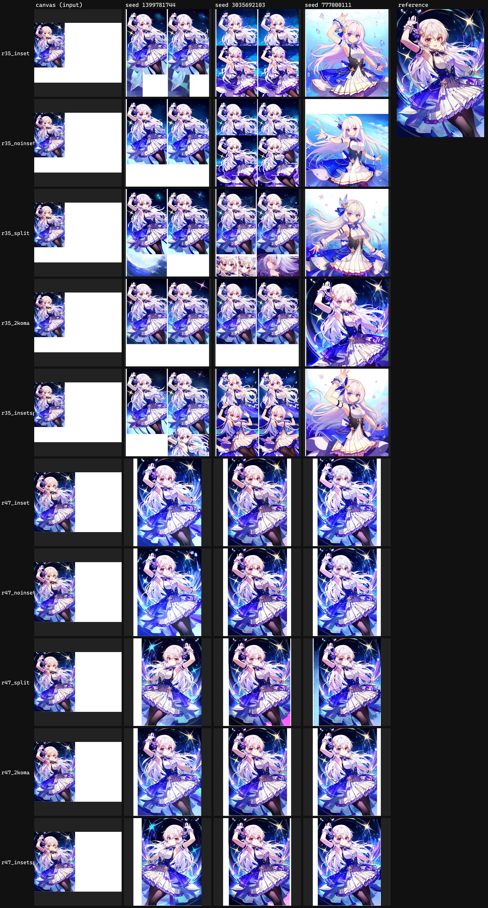

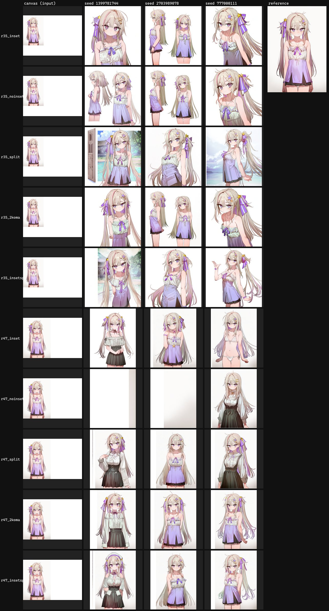

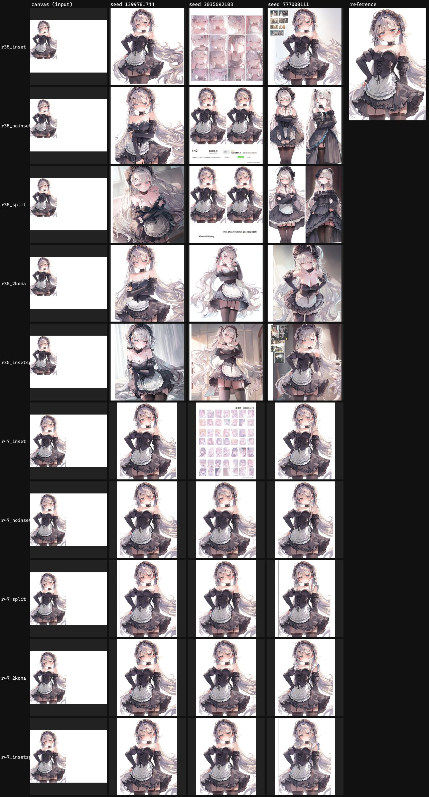

## V5 관찰 (통제하지 않은 결과)

V5 인페인트 모델(`nai-diffusion-5-full-inpainting`)로 앱에서 뽑은 이미르 결과 32장입니다. 감정, 시드,
스텝이 섞여 있어 조건별 비교는 할 수 없습니다.

- 원본이 정사각형(1024×1024)이라 좁은 참고 칸에 넣으면 아주 작아졌습니다. 참고 영역 25%에서는
  304×304, 35%에서는 424×424로 그려졌고, 아래는 흰 여백이었습니다.
- 의상 구성, 투톤 머리색, 비녀는 대부분 유지됐습니다.
- 머리색이 밝은 하늘색으로 바뀌거나, 광택이 많은 채색, 체형 과장, 치마색 변경이 일부 나왔습니다.

참고 그림이 작아서라는 V4.5의 결과와 맞는 모습입니다. 같은 조건표로 비교한 결과는 실험 V에 있습니다.

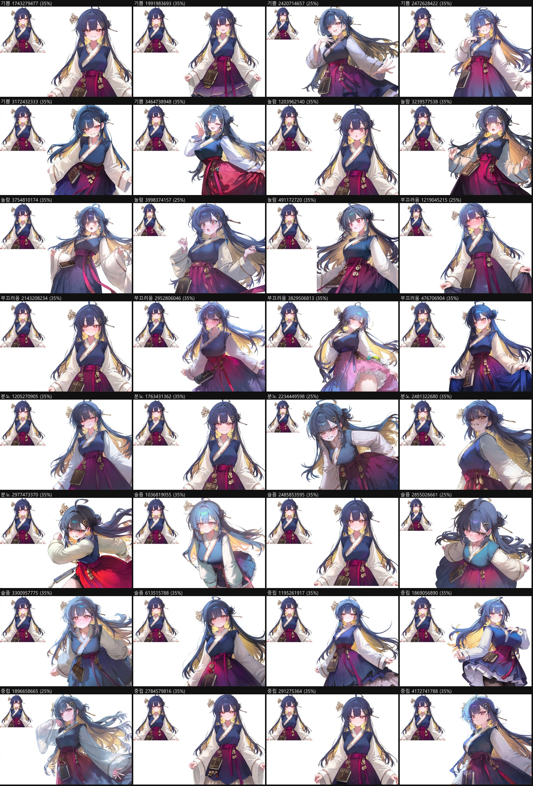

## 실전 정리

| 상황                                | 하면 좋은 것                                                                                                                                                                        |
| ----------------------------------- | ----------------------------------------------------------------------------------------------------------------------------------------------------------------------------------- |
| 원본 그림체를 지키고 싶다           | 생성 칸에 참고 그림 크기의 그림이 하나 들어가게 둡니다. 세로 832×1216 그림이면 1216×832·왼쪽·47%(캐릭터가 가장 큼) 또는 832×1216·위·전체 보이기·50%(V4.5에서 가장 안정적)입니다     |
| 캐릭터가 여러 명·여러 칸으로 나온다 | 참고 영역을 넓혀 생성 칸을 참고 그림 크기에 가깝게 줄입니다                                                                                                                         |
| 얼굴 아이콘만 잔뜩 나온다           | 생성 칸이 폭이 좁고 세로로 긴(1:2 이상) 모양입니다. 참고 영역을 줄이거나 캔버스를 바꿉니다                                                                                          |
| 흰 배경 참고 그림을 쓴다            | 참고 그림을 위에 두고 꽉 채우기로 상반신만 넣지 않습니다. 아랫몸을 이어 그립니다                                                                                                    |
| 결과 칸을 넓게 쓰고 싶다            | 권하지 않습니다. 작가 태그를 3개 이하로 줄이면 그림체는 지켜지지만, 흰 배경 그림이면 여러 명이 나오기 쉽습니다                                                                      |
| 꽉 채우기를 쓸까                    | 45~50%에서는 전체 보이기와 차이가 거의 없습니다. 좁은 참고 영역에서 쓰면 여러 칸으로 복제됩니다                                                                                     |
| 빈 종이나 글자 문서가 나온다        | 포지티브의 강한 음수 가중치(`-3::`)와 강조된 색 태그를 줄이거나 네거티브로 옮깁니다                                                                                                 |
| 의상이 바뀐다                       | 의상 태그를 캐릭터 프롬프트에 직접 적습니다                                                                                                                                         |
| V5를 쓴다                           | 1216×832·왼쪽·47%에 작가 태그 3개 이하, 또는 1024×1024·왼쪽·35%입니다. 세로 캔버스 위 배치는 V5에서 실패했습니다                                                                    |
| split screen·2koma를 넣을까         | 참고 영역이 충분하면 필요 없습니다. 좁은 영역에서 흰 배경 그림이 두 명으로 나오면 `split screen`을, V5면 `2koma`를 시도해 볼 만합니다. `split screen`은 배경 장면을 그리기 쉽습니다 |
| 다른 그림체로 만들고 싶다           | 메인 모델로 그 그림체의 참고 그림을 새로 만듭니다. 프롬프트만으로는 바뀌지 않습니다                                                                                                 |

## 한계

- V5는 실험 V(흰 배경의 3번 그림체 하나)만 했습니다. 3번 그림체를 V4.5로는 돌리지 않아, V4.5와의
  차이가 모델 때문인지 그림체 때문인지 완전히 가를 수는 없습니다. 짙은 배경 그림은 V5로 실험하지
  않았습니다.
- 그림체마다 캐릭터 하나, 감정 하나(중립), 조건마다 시드 세 개입니다. V5에서 표정 프롬프트가 참고
  그림의 표정을 얼마나 바꾸는지는 확인하지 않았습니다.
- 결과는 눈으로 비교해 판단했습니다.
- CFG를 낮추면 참고 그림을 더 따라가는지, 참고 칸과 생성 칸 사이에 경계를 표시하면 여러 명 그리기가
  줄어드는지는 아직 확인하지 않았습니다.
- 참고 그림은 세 장 모두 세로 832×1216이었습니다. 정사각형이나 가로 참고 그림은 실험하지 않았습니다.
